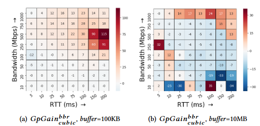
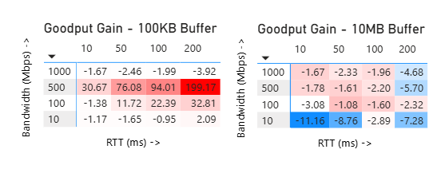

# Replicating "When to Use and When Not to Use BBR"
## Introduction
This project replicates results from "When to Use and When Not to Use BBR: An Empirical Analysis and Evaluation Study" by Yi Cao, Arpit Jain, Kriti Sharma, Aruna Balasubramanian, and Anshul Gandhi, published at IMC '19. The paper provides the first comprehensive empirical comparison of Google's BBR congestion control algorithm against Linux's default TCP CUBIC across a wide range of network conditions/configurations. The primary contribution of this study is a comprehensive evaluation across 640 configurations varying bandwidth, RTT, and bottleneck buffer size, producing a decision tree that tells practitioners which algorithm should be selected between BBR versus CUBIC for a specific workload/use-case. This evaluation is important because since BBR was adopted by google in 2016, no prior studies had provided clear guidance on when it actually helps versus when it hurts performance.
## Results/Claim Chosen and Why
I chose to replicate Figures 5(a) and 5(b) from Section 4.1.2 of the study documentation, which show heatmaps of the percentage goodput gain of BBR over CUBIC across different RTT and bandwidth combinations between a shallow buffer (100KB) and a deep buffer (10MB). These figures visualize the paper's central finding, that the relationship between buffer depth and bandwidth-delay determines which algorithm is most effective. I selected these specific figures because they provide the most visually compelling evidence, display the useful results shown in the paper, and because the experiment architecture (Mininet + iperf3 + tc) is reproducible on a single Linux machine without specialized hardware. The same case can not be made for LAN testbed which was also evaluated in the paper.
## Methodology Described in the Paper
The authors used three testbeds. Tests were run using Mininet, a physical LAN testbed, and a WAN link between Stony Brook and Rutgers universities. Each of these testbeds used a simple dumbbell topology where two hosts communicated through a bottlenecked router. They configured the router using Linux tc-tbf for bandwidth and buffer size control, and tc-netem for delay. They tested 8 RTT values (5–200ms), 8 bandwidth values (10–1000 Mbps), and 5 buffer sizes (0.1–50 MB) across both BBR and CUBIC, with 5 repetitions per configuration, totaling 3,200 iperf3 runs, lasting roughly 60 seconds a piece. Goodput was measured using iperf3 and the percentage gain of BBR over CUBIC was computed as: GpGain = (BBR_goodput - CUBIC_goodput) / CUBIC_goodput × 100.
## Methodology I Used (and How It Diverged)
I replicated the experiment using Mininet and iperf3 on a Linux Mint 22.3 desktop running kernel 6.17.0, compared to the paper's kernel 4.15. My dumbbell topology matched the paper's design: two hosts (h1 and h2) connected through a virtual router (r1) with switches (s1 and s2), where tc-tbf and tc-netem were applied on r1's outgoing interface to create the bottleneck. I reduced the parameter grid to 4 RTT values (10, 50, 100, 200ms), 4 bandwidth values (10, 100, 500, 1000 Mbps), and 2 buffer sizes (100KB and 10MB), with 3 repetitions per configuration for a total of 192 runs. This replacated approximately 10% of the paper's unique configurations. This reduction was necessary because I worked solo under a compressed timeline and may have caused some disturbance to the effectiveness of the study if putting my machine under load while concurrently running tests. The experiment was fully automated via a bash script calling a Python/Mininet script for each run, completing the test set in roughly 3 hours and 47 minutes unattended. Data analysis and heatmap visualization were performed in Excel and PowerBI using cumulative data captured on the script output CSV.
## Results
### Shallow Buffer (100KB)
My results confirm the paper's finding that BBR significantly outperforms CUBIC in shallow-buffer environments when the bandwidth-delay product is large. The strongest BBR advantage appeared at 500 Mbps with 200ms RTT, where BBR achieved roughly 199% higher goodput than CUBIC. At moderate bandwidth and RTT combinations (100 Mbps, 100–200ms RTT), BBR still showed gains of 22–33%. At low bandwidth (10 Mbps) and very high bandwidth (1000 Mbps), performance was roughly equivalent between the two algorithms.
### Deep Buffer (10MB)
In the deep buffer scenario, CUBIC outperformed BBR across all tested configurations, with advantages ranging from approximately 1.6% to 11.2%. The largest CUBIC advantage appeared at low bandwidth with low RTT (10 Mbps, 10ms), where the 10MB buffer far exceeded the BDP and CUBIC could fully utilize the available buffer capacity while BBR's 2× BDP in-flight cap left buffer space unused. Had I visualized the deep buffer true to the scale used in the paper, it would have been overwhelmingly obvious the performance benefit of CUBIC- although this was not done in order to perserve visual integrity.
### Comparison to Paper
These results align qualitatively with the paper's Figures 5(a) and 5(b). The paper found BBR gains exceeding 100% in shallow buffers at high BDP, and CUBIC gains up to 34% in deep buffers — both consistent with my findings. My 4×4 grid produces a coarser heatmap than the paper's 8×8 grid, but the same fundamental pattern is clearly visible: red (BBR wins) dominates the shallow buffer heatmap at high BDP, and blue (CUBIC wins) dominates the deep buffer heatmap uniformly.

# Discussion
The biggest challenge was the initial environment setup. This included installing Linux Mint, configuring Mininet, and getting the automation scripts to work reliably. A heredoc-based approach for embedding Python inside bash initially failed due to quoting issues, which was resolved by separating the experiment logic into a standalone Python file (run_one.py) called by the bash loop (run_experiments.sh). The tc-tbf burst parameter also required tuning to ensure the bandwidth was actually being bottlenecked properly. One of my initial tests showed a peak of 959 Mbps on what was supposed to be a 100 Mbps constrained link. This was corrected.
My results ran on a significantly newer kernel (6.17 vs. 4.15) and used only Mininet rather than a physical LAN testbed. Despite kernel differences, the overlap with the paper's findings suggests that the behavioral differences between BBR and CUBIC algorithms are fundamental to their designs and not artifacts of a specific kernel version or testbed, nor have they been influenced or updated in a functionally significant manner since the inception of the initial study. The fact that BBRv1's tendency to ignore packet loss helps it in shallow buffers and hurts it in deep buffers is a direct impact of its design, which has not fundamentally changed across kernel versions in any recognizeable manifestation.
# Skills Learned
This process provided some useful insight conducive to others studying this paper. First, BBR and CUBIC are both built into modern Linux kernels and can be switched with a single sysctl command. No recompilation or installation is required, vastly simplifying setup. Linux mint in particular also has the option for Reno algorithm as well, which could be added to the test if desired. Second, the retransmission data (this was logged but not visualized in my heatmaps, even though I had hoped to do so if I had the time) shows that BBR's goodput advantage in shallow buffers comes at the cost of dramatically higher retransmission quantities. Retransmissions from BBR would occur upwards of 100× more than CUBIC in some instanced, meaning BBR is much more aggressive and potentially unfair to competing flows. These findings also have direct real-world implications: shallow buffers are common in data center switches and ISP backbone equipment (where Google deploys BBR), while deep buffers are typical of home routers and enterprise networking gear (where CUBIC remains the better default). The entire experiment was conducted on a single desktop computer using Mininet's network emulation, demonstrating that meaningful research can be performed without access to specialized networking hardware or multi-machine testbeds, opening the doors for further experimentation with minimal investment.
